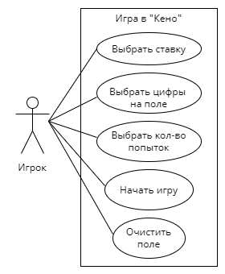

# Лабораторная работа №1

Диаграмма прецендентов со спецификацией для игры "Кено".

## Прецендент "Выбор ставки"

| | Выбор ставки |
|---|---|
| Название | Выбор ставки |
| Описание | Игрок выбирает ставку за один "спот" |
| Основной исполнитель | Игрок |
| Предусловия | Наличие у игрока денег для минимальной ставки |
| Постусловия | Ставка должна входить в установленные рамки |

**Основной сценарий:**

| Действия актора | Реакция системы |
|---|---|
| Игрок увеличивает (уменьшает) ставку | Ставка увеличена (уменьшена) |
| | Ставка зафиксирована |

**Альтернативы:**

| Действия актора | Реакция системы |
|---|---|
| Игрок увеличивает ставку | Ставка остается неизменной, т.к. у игрока недостаточно денег |

| Действия актора | Реакция системы |
|---|---|
| Игрок уменьшает (увеличивает) ставку | Ставка остается неизменной, т.к. выходит за установленные пределы |

## Прецендент "Выбор цифр на поле"

| | Выбор цифр на поле ("спотов") |
|---|---|
| Название | Выбор цифр на поле |
| Описание | Игрок выбирает цифры на поле, на которые делает ставку |
| Основной исполнитель | Игрок |
| Предусловия | Поле с цифрами от 1 до 80 |
| | Установлена ставка |
| Постусловия | Должно быть выбрано от 1 до 15 цифр |
| | Количество денег у игрока должно покрывать сумму ставки (Кол-во "спотов" * ставка) |

**Основной сценарий:**

| Действия актора | Реакция системы |
|---|---|
| Игрок выбирает цифру на поле | Выбор запоминается |

**Альтернативы:**

| Действия актора | Реакция системы |
|---|---|
| Игрок выбирает цифру на поле | Выбор не запоминается, т.к. у игрока недостаточно денег для увеличения кол-ва "спотов" |

| Действия актора | Реакция системы |
|---|---|
| Игрок выбирает цифру на поле | Выбор не запоминается, т.к. игрок уже выбрал 15 "спотов" |

## Прецендент "Выбор количества попыток"

| | Выбор количества попыток |
|---|---|
| Название | Выбор количества попыток |
| Описание | Игрок выбирает количество попыток, которое будет сыграно с выбранными "спотами" |
| Основной исполнитель | Игрок |
| Предусловия | Установлена ставка |
| | Выбраны "споты" |
| Постусловия | Количество денег у игрока должно покрывать сумму ставки (Кол-во "спотов" * ставка * кол-во попыток) |

**Основной сценарий:**

| Действия актора | Реакция системы |
|---|---|
| Игрок увеличивает кол-во попыток | Выбор запоминается |

**Альтернативы:**

| Действия актора | Реакция системы |
|---|---|
| Игрок увеличивает кол-во попыток | Выбор не запоминается, т.к. у игрока не достаточно денег |

| Действия актора | Реакция системы |
|---|---|
| Игрок увеличивает (уменьшает) кол-во попыток | Выбор не запоминается, т.к. кол-во попыток выходит за установленные пределы |

## Прецендент "Очистка поля"

| | Очистить поле |
|---|---|
| Название | Очистка поля |
| Описание | Игрок очищает поле |
| Основной исполнитель | Игрок |
| Предусловия | Выбраны "споты" |
| Постусловия | Не выбран ни один "спот" |

**Основной сценарий:**

| Действия актора | Реакция системы |
|---|---|
| Игрок очищает поле | Поле очищено |

**Альтернативы:**

| Действия актора | Реакция системы |
|---|---|
| Игрок очищает поле | Поле не изменяется, т.к. "споты" не были выбраны |

## Прецендент "Начало игры"

| | Разыграть номера |
|---|---|
| Название | Начало игры |
| Описание | Игрок инициирует розыгрыш номеров |
| Основной исполнитель | Игрок |
| Предусловия | Выбраны "споты" |
|| Выбрана ставка |
|| Выбрано кол-во попыток |
| Постусловия | С игрока списана сумма ставки |

**Основной сценарий:**

| Действия актора | Реакция системы |
|---|---|
| Нажатие кнопки "Начать игру" | Победные номера отмечаются на поле |

**Альтернативы:**

| Действия актора | Реакция системы |
|---|---|
| Нажатие кнопки "Начать игру" | Сообщает игроку о необходимости выбрать "споты" |
