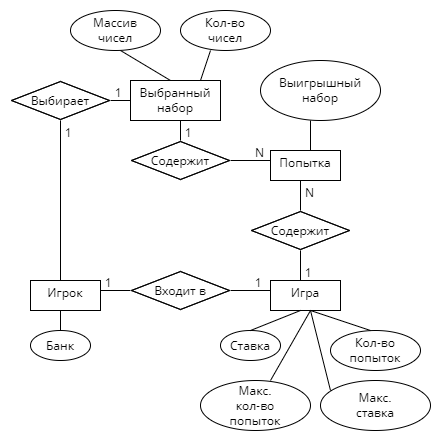

# Лабораторная работа №2

Модель предметной области

## Инициализация игры:
При запуске игроку начисляется стартовый "банк".

Игрок выбирает "споты" на поле (от 1 до 15), они сохраняются в выбранный набор для игры.

Для начала игры игрок выбирает количество попыток для выбранного набора и ставку.

## Процесс игры
Для каждой попытки генерируется один победный набор "спотов".

Выбранный набор сравнивается с победным в каждой попытке. В случае минимального количества совпадений, которое зависит от количества выбранных "спотов", считается выигрыш. Банк игрока изменяется после каждой попытки, общий выигрыш за все попытки сохраняется в информации об игре.
