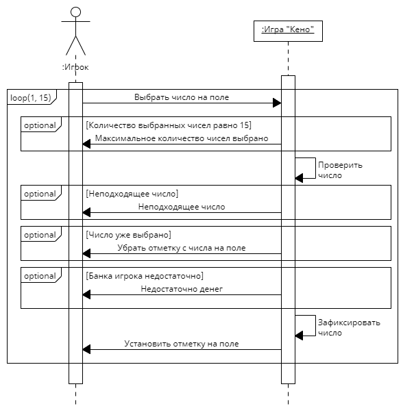

# Создание системных диаграмм последовательностей

## Прецендент "Выбор ставки":

|| Выбрать ставку |
|---|---|
| Ссылки | Прецендент: Выбор ставки |
| Предусловия | Наличие у игрока денег для минимальной ставки |
| Постусловия | Ставка должна входить в установленные рамки |

|| Зафиксировать ставку в размере банка игрока |
|---|---|
| Ссылки | Прецендент: Выбор ставки |
| Предусловия | Игрок выбирает ставку больше своего банка или ставка больше максимальной |
| Постусловия | Ставка равна банку игрока |

|| Зафиксировать максимальную ставку |
|---|---|
| Ссылки | Прецендент: Выбор ставки |
| Предусловия | Игрок выбрал ставку больше максимальной |
| Постусловия | Ставка максимально возможная |

|| Зафиксировать ставку |
|---|---|
| Ссылки | Прецендент: Выбор ставки |
| Предусловия | Ставка валидна |
| Постусловия | Ставка зафиксирована для игры |

|| Отобразить ставку |
|---|---|
| Ссылки | Прецендент: Выбор ставки |
| Предусловия | Ставка зафиксирована |
| Постусловия | Ставка на экране |

## Прецендент "Выбор чисел на поле":

|| Выбрать число на поле |
|---|---|
| Ссылки | Прецендент: Выбор чисел на поле |
| Предусловия | Число не выбрано |
| | Банка игрока достаточно |
| Постусловия | Число выбрано |

|| Максимальное количество чисел выбрано |
|---|---|
| Ссылки | Прецендент: Выбор чисел на поле |
| Предусловия | Количество выбранных чисел равно 15 |
| Постусловия | Число не выбрано |

|| Проверить число |
|---|---|
| Ссылки | Прецендент: Выбор чисел на поле |
| Предусловия | Игрок выбрал число |
| | Количество выбранных чисел меньше 15 |
| Постусловия | Валидность числа |

|| Неподходящее число |
|---|---|
| Ссылки | Прецендент: Выбор чисел на поле |
| Предусловия | Число невалидно |
| Постусловия | Число не выбрано |

|| Убрать отметку с числа на поле |
|---|---|
| Ссылки | Прецендент: Выбор чисел на поле |
| Предусловия | Число выбрано |
| Постусловия | Число не выбрано |

|| Недостаточно денег |
|---|---|
| Ссылки | Прецендент: Выбор чисел на поле |
| Предусловия | Сумма ставки превышает банк игрока |
| Постусловия | Число не выбрано |

|| Установить отметку на поле |
|---|---|
| Ссылки | Прецендент: Выбор чисел на поле |
| Предусловия | Число возможно выбрать |
| Постусловия | Число выбрано |

|| Зафиксировать число |
|---|---|
| Ссылки | Прецендент: Выбор чисел на поле |
| Предусловия | Количество выбранных чисел меньше 15 |
| | Банк игрока покрывает ставку |
| Постусловия | Зафиксировано число |

## Прецендент "Выбор количества попыток":

|| Указать количество попыток |
|---|---|
| Ссылки | Прецендент: Выбор количества попыток |
| Предусловия | Выбраны споты |
| | Банка игрока достаточно |
| Постусловия | Выбрано количество попыток |

|| Установить максимально возможное число попыток |
|---|---|
| Ссылки | Прецендент: Выбор количества попыток |
| Предусловия | Банка игрока недостаточно |
| Постусловия | Число попыток - максимальное |

|| Зафиксировать число попыток |
|---|---|
| Ссылки | Прецендент: Выбор количества попыток |
| Предусловия | Число попыток валидное |
| Постусловия | Число попыток зафиксировано для игры |

|| Число попыток |
|---|---|
| Ссылки | Прецендент: Выбор количества попыток |
| Предусловия | Чисто попыток зафиксировано |
| Постусловия | Число попыток отобразилось на экране |

## Прецендент "Начало игры":

|| Начать игру |
|---|---|
| Ссылки | Прецендент: Начало игры |
| Предусловия | Выбраны споты |
| | Выбрана ставка |
| | Выбрано количество попыток |
| Постусловия | Игра началась |

|| Вычесть с банка игрока сумму ставки |
|---|---|
| Ссылки | Прецендент: Начало игры |
| Предусловия | Игра началась |
| Постусловия | Банк игрока уменьшился на сумму ставки |

|| Сгенерировать победный набор |
|---|---|
| Ссылки | Прецендент: Начало игры |
| Предусловия | Игра началась |
| Постусловия | Победный набор зафиксирован для игры |

|| Отобразить победный набор |
|---|---|
| Ссылки | Прецендент: Начало игры |
| Предусловия | Победный набор зафиксирован для игры |
| Постусловия | Победный набор отмечен на поле |

|| Сравнить выбор игрока и победный набор |
|---|---|
| Ссылки | Прецендент: Начало игры |
| Предусловия | Победный набор зафиксирован для игры |
| Постусловия | Зафиксировать совпадения |

|| Вычислить выигрыш |
|---|---|
| Ссылки | Прецендент: Начало игры |
| Предусловия | Есть совпадения между выбором игрока и победным набором |
| Постусловия | Выигрыш зафиксирован для игры |

|| Начислить выигрыш на банк игрока |
|---|---|
| Ссылки | Прецендент: Начало игры |
| Предусловия | Выигрыш зафиксирован для игры |
| Постусловия | Банк игрока увеличился на выигрыш |

## Прецендент "Очистить поле":

|| Очистить поле |
|---|---|
| Ссылки | Прецендент: Очистить поле |
| Предусловия | Поле не очищено |
| Постусловия | Запрос на очистку поля |

|| Сбросить выбранный набор |
|---|---|
| Ссылки | Прецендент: Очистить поле |
| Предусловия | Запрос на очистку поля |
| Постусловия | Сброс выбранного набора для игры |

|| Убрать отметки на выбранных числах |
|---|---|
| Ссылки | Прецендент: Очистить поле |
| Предусловия | Выбранный набор для игры сброшен |
| Постусловия | Поле очищено |