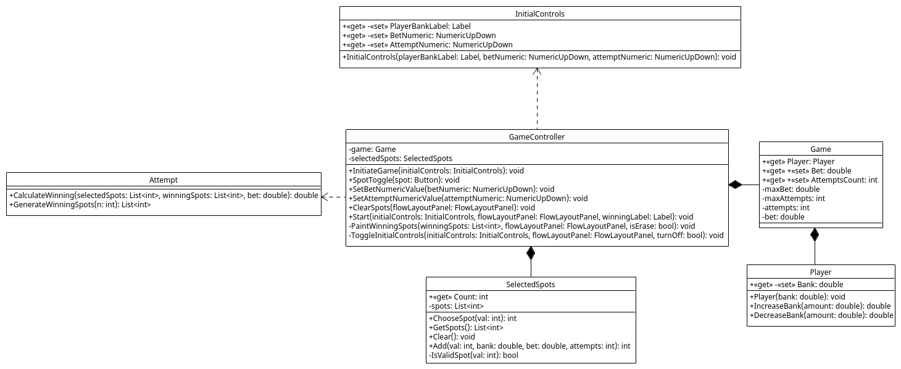

# Лабораторная работа №5

### Диаграмма классов

## Класс Attempt (Попытка):
| Метод | Аргументы | Возвращаемый тип | Описание |
|--|--|--|--|
| GenerateWinningSpots | n: int - размер массива победных чисел | List\<int> | Генерирует случайный массив победных чисел |
| CalculateWinning | selectedSpots: List\<int> - массив чисел, выбранных игроком winningSpots: List\<int> - массив сгенерированных победных чисел bet: double - ставка | double | Проверяет наличие совпадений в выбранном и победном наборах и подсчитывает выигрыш |

## Класс SelectedSpots (Набор выбранных спотов для игры):
| Свойство     | Тип       | Описание              |
|--------------|-----------|-----------------------|
| Count | int | Количество выбранных игроком спотов |

| Поле     | Тип       | Описание              |
|--------------|-----------|-----------------------|
| spots | List\<int> | Выбранные игроком споты |

| Метод | Аргументы | Возвращаемый тип | Описание |
|--|--|--|--|
| ChooseSpot | val: int - выбранный спот | int | Добавляет/убирает выбранный спот в список spots |
| Clear |  |  | Очищает список выбранных игроком спотов |
| Add | val: int - выбранный спот | int | Добавляет спот в список spots |
| IsValidSpot | val: int - выбранный спот | int | Проверяет, можно ли выбрать данный спот |
| GetSpots | | List\<int> | Возвращает значение поля spots (getter для "spots") |

## Класс Player (Игрок):
| Свойство     | Тип       | Описание              |
|--------------|-----------|-----------------------|
| Bank | double | Банк игрока |

| Метод | Аргументы | Возвращаемый тип | Описание |
|--|--|--|--|
| Player | bank: double - начальный банк |  | Конструктор |
| IncreaseBank | amount: double - значение для изменения банка  | double | Увеличивает банк игрока |
| DecreaseBank | amount: double - значение для изменения банка  | double | Уменьшает банк игрока |

## Класс Game (Игра):
| Свойство     | Тип       | Описание              |
|--------------|-----------|-----------------------|
| Player | Player | Игрок |
| Bet | double | Реализует геттер и сеттер для поля bet |
| AttemptsCount | int | Реализует геттер и сеттер для поля attempts |

| Поле     | Тип       | Описание              |
|--------------|-----------|-----------------------|
| maxBet | double | Максимальная ставка |
| maxAttempts | int | Максимальное кол-во попыток |
| attempts | int | Кол-во попыток |
| bet | double | Ставка |

## Класс GameController:
| Поле     | Тип       | Описание              |
|--------------|-----------|-----------------------|
| game | Game | Экземпляр класса Game для игры |
| selectedSpots | SelecetedSpots | Экземпляр класса SelectedSpots для игры |

| Метод | Аргументы | Возвращаемый тип | Описание |
|--|--|--|--|
| InitiateGame | initialControls: InitialControls - набор элементов формы для старта |  | Вызывается при запуске игры, задает начальные значения для элементов формы |
| SpotToggle | spot: Button - выбранный спот | | Обработчик выбора спота пользователем |
| SetBetNumericValue | betNumeric: NumericUpDown - элемент формы для ставки | | Обработчик для ставки пользователя |
| SetAttemptNumericValue | attemptNumeric: NumericUpDown - элемент формы для количества попыток | | Обработчик для количества попыток пользователя |
| ClearSpots | flowLayoutPanel: FlowLayoutPanel - элемент, содержащий споты | | Сбрасывает выбранные пользователем споты |
| Start | initialControls: InitialControls - набор элементов формы для старта; flowLayoutPanel: FlowLayoutPanel - элемент, содержащий споты; winningLabel: Label - элемент, отображающий выигрыш | | Обработчик для начала игры |
| PaintWinningSpots | winningSpots: List\<int> - победный набор; flowLayoutPanel: FlowLayoutPanel - элемент, содержащий споты; isErase: bool - стирать? | | Рисует или стирает споты победного набора |
| ToggleInitialControls | initialControls: InitialControls - набор элементов формы для старта; flowLayoutPanel: FlowLayoutPanel - элемент, содержащий споты; turnOff: bool - выключить? | | Блокирует или разблокирует элементы формы для старта |

## Класс InitialControls:
| Свойство     | Тип       | Описание              |
|--------------|-----------|-----------------------|
| PlayerBankLabel | Label | Элемент формы, отображающий банк игрока |
| BetNumeric | NumericUpDown | Элемент формы, отображающий ставку |
| AttemptNumeric | NumericUpDown | Элемент формы, отображающий количество попыток |

| Метод | Аргументы | Возвращаемый тип | Описание |
|--|--|--|--|
| InitialControls | playerBankLabel: Label - Элемент формы, отображающий банк игрокаж; betNumeric: NumericUpDown - Элемент формы, отображающий ставку; attemptNumeric: NumericUpDown - Элемент формы, отображающий количество попыток  |  | Конструктор |